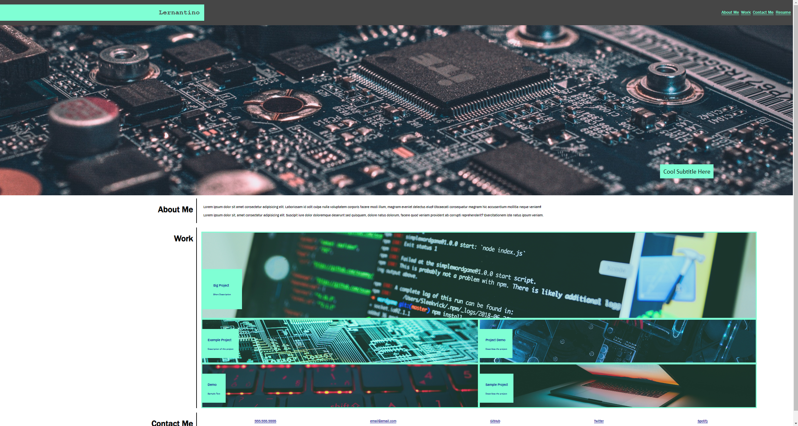

# <Portfolio Demo>

## Description

My motivation for this project was to develop my first website from scratch utilizing html and css.
I built this project to further my understanding of implementing css and to become more familiar with the language.
It was also helpful to gain experience working from a blank slate.
In the future I may revisit this project as a future template for any website I want to build.
It is also extremely useful if I want to create a portfolio and I will definitely revisit this when I have projects to populate the entries.

## Installation

The project is being hosted through GitHub sites.
No software installation is required, just visit the url at:
https://christophgonz.github.io/challenge-2-portfolio/

The repository for the application can be viewed at the following:
https://github.com/Christophgonz/challenge-2-portfolio

## Usage

When clicking on any links or images, it currently does not have any external functionality.
The links operational links are the ones to view certain sections within the document.
It is under consideration to populate the demos and links with relevant information if the project is to be returned to.

A preview of the website can be seen in the following image

## Credits

motherboard image: Alexandre Debiève - https://unsplash.com/photos/FO7JIlwjOtU

computer screen image: Desola Lanre-Ologun - https://unsplash.com/photos/vII7qKAk-9A

chip image: Adi Goldstein - https://unsplash.com/photos/EUsVwEOsblE

keyboard image: Daniel Josef - https://unsplash.com/photos/AMssSjUaTY4

internals image: Cristiano Firmani - https://unsplash.com/photos/tmTidmpILWw

laptop image: Ales Nesetril - https://unsplash.com/photos/Im7lZjxeLhg

